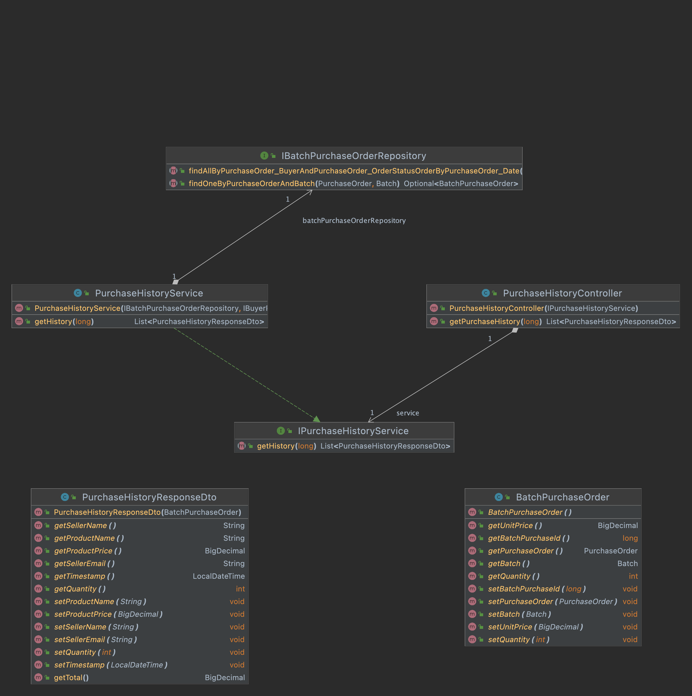

# Requisito 6
API REST desenvolvida pelo grupo Beta Campers para o Projeto Integrador feito durante o IT Bootcamp Backend Java (wave 6).

# Funcionalidades

## Purchase History

`GET /api/v1/purchase-history`  
Busca histórico de compras. Exemplo de Response:
 
<pre><code>[
    {
        "productName": "Queijo",
        "productPrice": 7.50,
        "sellerName": "João",
        "sellerEmail": "joao@example.com",
        "timestamp": "2022-08-16T14:22:57.923892",
        "quantity": 2,
        "total": 15.00
    }
]
</code></pre>
